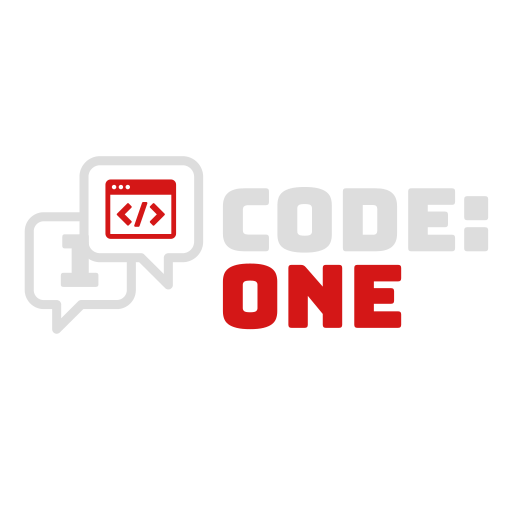

    

# ./willkommen

Auf dieser Webseite finden Sie alle relevanten Dokumente, von Präsentationen für JourFixes bis hin zu Feature-Beschreibungen und Dokumentationen über das Projekt.
  
* * *  
  
# ./files  

* subpages  
Currently none! [WIP]

* ./jourfixe -ls  
 
Aktuell:  
[./jourfixe 1](jourfixes/jourfixe_1)  
 
Archiv:  
[./jourfixe 2](jourfixes/jourfixe_2)  
[./jourfixe 3](jourfixes/jourfixe_3)

* documents  
[./Beispieldokument.txt](assets/documents/example.txt)  
[./Dokumentation.txt](assets/documents/example.txt)  
  
* * *  
  
# ./about_us
Wir sind das Softwareentwicklungsteam 1, eine studentische Softwareentwicklergruppe, welche im Rahmen des SEP (Softwareentwicklungprojekts) an der Hochschule Mannheim im Sommersemester 2022 an einem Projekt arbeitet.
  
# ./contact_us

Sie können uns jederzeit wie folgt erreichen:  

    <a href="mailto:nojomyth@gmx.de?subject=Anfrage%20zum%20SEP%20-%20" style="font-size:35px; text-decoration: none; color: white;"><i class="fa-solid fa-envelope"></i>nojomyth@gmx.de</a>

Wir antworten schnellstmöglich auf Ihre Anfrage, im Normalfall erhalten Sie innerhalb von spätestens 24h eine Antwort.