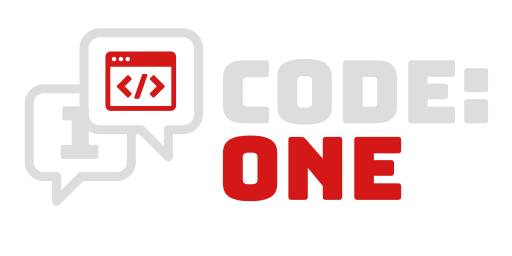

    

# ./willkommen

Auf dieser Webseite finden Sie alle relevanten Dokumente, von Präsentationen für Jour fixe bis hin zu Feature-Beschreibungen und Dokumentationen über das Projekt "Meet:One".
Bitte beachten Sie, dass wir nicht alle Dokumente veröffentlichen werden. Dies hat verschiedene Gründe (Datenschutz, Einverständnis von beteiligten Personen felt, u.a.).  

[Our Product](https://meetoneapp.com)
* * *  
  
# ./files  

* ls aktuelles  
[./final_presentation](./pages/final_presentation/)  
[./jourfixe 6](./pages/jourfixe_6/)  

* ls archiv  
[./jourfixe 5](./pages/jourfixe_5/)  
[./review 3](./pages/review_3/)  
[./architecture](./pages/architecture/)    
[./review 2](./pages/review_2/)  
[./jourfixe 3](./pages/jourfixe_3/)  
[./review 1](./pages/review_1/)  
[./jourfixe 2](./pages/jourfixe_2/)  
[./interview](pages/interviews/)  
[./jourfixe 1](./pages/jourfixe_1/)  

* * *  
# ./idee
Unsere Idee ist es, ein Produkt zu entwickeln, welches kleine Scrum-Teams (4-7 Entwickler inkl. Scrummaster und Productowner) im Alltag
bei der Organisation unterstützt. Durch problemorientiertes Denken haben wir verschiedene Aspekte gefunden, welche uns im Alltag als agile Softwareentwickler stören.  
[./more idea.txt](./pages/ideas/)

* * *
# ./api_documentation
Hier finden Sie unsere API-Dokumentation zu Meet:One.  
[./more api_documentation.txt](./pages/api_documentation/index.html)  
[./more openapi.txt](./pages/api_documentation/spec.yaml)

* * *
# ./about_us
Wir sind das Softwareentwicklungsteam von Code: One n.e.V., eine studentische Softwareentwicklergruppe, welche im Rahmen des SEP (Softwareentwicklungprojekts) eine App für Meetings erstellt. Unser Ziel ist die Digitalisierung und effizientere Gestaltung von Meetings. 
Zum Beitreten in unseren Verein können Sie uns über unsere E-Mail kontaktieren.

# ./contact_us

Sie können uns jederzeit wie folgt erreichen:  

    <a href="mailto:support@codeone.space?subject=Anfrage%20zum%20SEP%20-%20" style="font-size:35px; text-decoration: none; color: white;"><i class="fa-solid fa-envelope"></i>support@codeone.space</a>

Wir antworten schnellstmöglich auf Ihre Anfrage. Im Normalfall erhalten Sie werktags innerhalb von spätestens 24h eine Antwort.
